# Gym Management System — Complete Product Overview & Knowledge Base

> **Document type:** Combined PRD + SRS + BRD + TDD + Functional Specification
> **Status:** Reverse-engineered single source of truth
> **Scope:** Entire product (frontend, backend, database, business logic, finance, UX/UI, security)
> **Audience:** Product, Engineering, QA, Design, Onboarding, Strategy

**Legend:** ✅ Implemented · 🟡 Partial / basic · ❌ Not present (gap / future) · 🔒 Assumption (labelled inline)

---

## Table of Contents

1. [Executive Overview](#1-executive-overview)
2. [Product Architecture](#2-product-architecture)
3. [Route Documentation](#3-route-documentation)
4. [Page Documentation](#4-page-documentation)
5. [User Roles & Permission Matrix](#5-user-roles--permission-matrix)
6. [Business Modules](#6-business-modules)
7. [Functional Documentation](#7-functional-documentation)
8. [Business Workflows](#8-business-workflows)
9. [Finance Documentation](#9-finance-documentation)
10. [Data Model](#10-data-model)
11. [API Documentation](#11-api-documentation)
12. [Component Library](#12-component-library)
13. [UX Documentation](#13-ux-documentation)
14. [UI / Design System](#14-ui--design-system)
15. [Security](#15-security)
16. [Notification System](#16-notification-system)
17. [Reporting System](#17-reporting-system)
18. [Settings](#18-settings)
19. [Integrations](#19-integrations)
20. [State Management](#20-state-management)
21. [Complete Business Logic](#21-complete-business-logic)
22. [QA Documentation](#22-qa-documentation)
23. [Future Scalability](#23-future-scalability)
24. [Project Knowledge Base & Diagrams](#24-project-knowledge-base--diagrams)

---

## 1. Executive Overview

### 1.1 What is this product?
A **multi-tenant Gym Management SaaS / ERP** that lets a gym run its entire operation from one dashboard: member lifecycles, lead/CRM pipeline, membership plans & billing, attendance check-ins, supplement inventory, expenses, and financial reporting. It ships as a **Flutter application** (Windows desktop + Android APK) backed by a **Node.js/Express + MySQL** API.

### 1.2 Business problem solved
Small-to-mid gyms typically juggle registers, spreadsheets, and WhatsApp. This product consolidates:
- Who is a **member**, and when does their membership **expire**?
- Who **owes money** (unpaid/partial invoices) and how much revenue came in?
- Who are the **leads** and when to follow up?
- What **stock** (supplements) is low?
- What are the **profit/loss** trends?
- **Re-engagement** of at-risk (no-check-in) members via WhatsApp.

### 1.3 Target customers
Independent gyms and small local chains (owner-operated), gym receptionists, and gym admins — primarily in **Pakistan** (default currency **PKR**, WhatsApp-first reminders).

### 1.4 Industry
Fitness / Health & Wellness · Vertical SaaS · SMB ERP.

### 1.5 Business model & revenue model
🔒 **Assumption (not enforced in code):** SaaS subscription per gym (per-tenant). The codebase is **multi-tenant-ready** (`tenant_id` on every table) but contains **no billing-for-the-SaaS** logic, no plan/seat metering, and no self-service signup — only an admin-gated `/dev/seed` bootstrap. Current monetisation is therefore **manual onboarding / per-deployment**. The *gym's own* revenue (member fees) is fully modelled; the *SaaS vendor's* revenue is not.

### 1.6 Product goals & core objectives
- Single pane of glass for daily gym operations.
- Zero-spreadsheet billing with partial-payment support.
- Proactive retention (at-risk members, expiry reminders).
- Premium, fast desktop-first UX that also works on mobile.

### 1.7 Long-term vision
Become the default operating system for local gyms: cloud-hosted, multi-branch, automated reminders, online payments, and white-label capability.

### 1.8 Market competitors & positioning
| Competitor | Segment | This product's positioning |
|---|---|---|
| Zenoti, Mindbody | Enterprise, global | Lightweight, local-first, affordable |
| GymMaster, Glofox | Mid-market | Simpler, PKR/WhatsApp-native |
| Spreadsheets / registers | Status quo | The upgrade path |

### 1.9 Unique selling points
- **Premium "Obsidian × Gold × Emerald" UI** with a **dynamic brand-colour picker**.
- **WhatsApp-native** dues/expiry reminders (no SMS/email cost).
- **Partial-payment ledger** (invoice stays open until fully paid).
- **Offline-capable desktop** + shareable **Android APK**.
- **In-app PDF** invoices/reports (server-generated via PDFKit).

---

## 2. Product Architecture

### 2.1 Overall style
**Client–server monolith** (not microservices). One Flutter client → one Express API → one MySQL database.

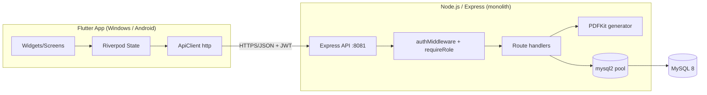

### 2.2 Layer-by-layer

| Concern | Implementation | Status |
|---|---|---|
| **Frontend** | Flutter (Dart ≥3.10), Riverpod, GoRouter, google_fonts, fl_chart, printing, qr_flutter, flutter_colorpicker, url_launcher | ✅ |
| **Backend** | Node.js (ESM), Express 4, mysql2 (pooled, named placeholders) | ✅ |
| **Database** | MySQL 8, multi-tenant (`tenant_id` FK everywhere) | ✅ |
| **Auth** | JWT (HS256, 7-day expiry), bcryptjs password hashing | ✅ |
| **Authorization** | `requireRole('owner','admin',...)` middleware | ✅ |
| **Validation** | `zod` schemas on request bodies | ✅ |
| **PDF / reports** | `pdfkit`, streamed to client, previewed in-app via `printing` | ✅ |
| **Caching** | None (no Redis/memory cache) | ❌ |
| **Storage / uploads** | None persisted (receipt "upload" is a UI placeholder) | ❌ |
| **Notifications** | WhatsApp deep-links (`wa.me`) via url_launcher | 🟡 |
| **Logs** | `system_logs` table + `console.error` | 🟡 |
| **Analytics** | In-app dashboard/reports only (no external analytics) | 🟡 |
| **Queues / background jobs / cron** | None; a few idempotent `CREATE TABLE`/`ALTER` migrations run on boot | ❌ |
| **WebSockets / real-time** | None; dashboard "auto-refresh" is client-side polling/invalidation | ❌ |
| **CDN** | None | ❌ |
| **Deployment** | Local (desktop + `npm start`), ngrok tunnel (demo), cloud (Railway per `DEPLOY.md`) | ✅ guide |
| **Scalability** | Vertical (single node + connection pool of 10) | 🟡 |

### 2.3 Infrastructure & config
- Server binds `0.0.0.0:${PORT|8081}`; DB via env (`DB_HOST/PORT/USER/PASSWORD/NAME`, optional `DB_SSL`).
- App base URL resolution order: `--dart-define=API_BASE_URL` → `kProductionApiUrl` (release) → platform localhost fallback → **in-app "Server settings" override** (persisted).
- Android release manifest: `INTERNET` permission + `usesCleartextTraffic=true`.

---

## 3. Route Documentation

Routing = **GoRouter** with a `ShellRoute` (persistent sidebar/drawer + top bar) wrapping all authenticated routes. Redirect guard: unauthenticated → `/login`; authenticated on `/login` → `/dashboard`; role-gated routes redirect to `/dashboard` if unauthorized.

| Route | Screen | Auth | Roles (view) | Purpose |
|---|---|---|---|---|
| `/login` | LoginScreen | Public | — | Tenant + email + password sign-in; in-app Server settings |
| `/dashboard` | DashboardScreen | ✅ | all | KPIs, charts, at-risk, activity, quick actions |
| `/leads` | LeadsScreen | ✅ | all | CRM pipeline |
| `/members` | MembersScreen | ✅ | all | Member directory & lifecycle |
| `/plans` | PlansScreen | ✅ | all | Membership plans |
| `/attendance` | AttendanceScreen | ✅ | all | Check-in kiosk & logs |
| `/invoices` | InvoicesScreen | ✅ | owner/admin (revenue) | Billing |
| `/payments` | PaymentsScreen | ✅ | owner/admin | Collections ledger |
| `/expenses` | ExpensesScreen | ✅ | owner/admin | Expense ledger |
| `/inventory` | InventoryScreen | ✅ | non-receptionist | Products/stock |
| `/reports` | ReportsScreen | ✅ | owner/admin | Analytics & PDF exports |
| `/staff` | StaffScreen | ✅ | owner/admin | User/role management |
| `/settings` | SettingsScreen | ✅ | owner/admin | Gym config & branding |

**Client-side route guard logic (in `app.dart` redirect):**
- `canSeeRevenue = owner|admin|super_admin` → gates `/invoices`, `/payments`, `/expenses`, `/reports`.
- `canSeeInventory = !(receptionist-only)` → gates `/inventory`.
- `canManageStaff` / `canSeeSettings` = `owner|admin|super_admin` → gate `/staff`, `/settings`.

### 3.1 Per-route template (representative — Members)
| Aspect | Detail |
|---|---|
| **Data loaded** | `GET /members` (list, filters q/status/from/to), `GET /members/:id/detail` on view |
| **State** | `membersControllerProvider` (Riverpod `AsyncValue<List<Member>>`) |
| **Actions** | Add, Edit, View (bottom sheet), Renew, Freeze/Unfreeze, Remove plan, QR, Delete, Export CSV, PDF |
| **Loading** | CircularProgressIndicator; **Empty** `_EmptyState`; **Error** inline text |
| **Success** | SnackBar toasts |
| **Validation** | Name ≥2, email `@`, plan required |
| **Responsive** | ≥900px DataTable; <900px stacked cards; header actions Wrap on mobile |

*(Every other route follows the same shape — see §4 for page-level detail and §11 for the APIs each consumes.)*

---

## 4. Page Documentation

> Common to all pages: persistent **Sidebar** (desktop) / **Drawer** (mobile ≤900px), **Top bar** (refresh, theme toggle, notifications/expiry bell, global search, Quick-Actions "+", account menu), toast feedback, and PKR currency.

### 4.1 Login (`/login`)
- **Purpose/User:** Authenticate a gym staff member.
- **Widgets:** Tenant/Email/Password fields, show-password toggle, error banner, **Server settings** (collapsible URL override + Apply/Default), Login button, theme toggle, "Powered by Deverosity".
- **Debug:** auto-fills `demo / admin@demo.com / admin123` in debug builds only.
- **States:** loading (button spinner), error (invalid credentials / cannot connect), success (→ dashboard).
- **Responsive:** scrollable card (keyboard-safe); split hero panel on ≥980px.

### 4.2 Dashboard (`/dashboard`)
- **Goal:** At-a-glance operational + financial health.
- **Cards/KPIs:** Total Revenue, Revenue (30d), Active Members, Frozen Members, Unpaid Dues, Today's Check-ins, Plans (gated by `canSeeRevenue`).
- **Charts:** Revenue (7 days) line chart; Active vs Expired donut.
- **Panels:** Hero banner (greeting + quick actions: Add member/Check-in/Invoices/Leads), **At-Risk Members** (no check-in ≥N days, WhatsApp CTA), **Recent Activity** feed (check-ins/payments, auto-refresh, collapsible), **Insights** card.
- **Data:** `GET /dashboard/summary`, `GET /dashboard/activity`, at-risk provider.
- **Empty/Loading/Error:** each panel handles independently.
- **Mobile:** KPIs → 1 col; hero actions → 2×2 grid; charts fluid; list text wraps (2 lines).

### 4.3 Leads (`/leads`)
- **Purpose:** CRM pipeline + follow-up.
- **Filters:** search, status, source, interest, date pills (Overdue/Today/Tomorrow/Next-7), sort by next contact (single swipe-scroll strip on mobile).
- **Form fields:** name, phone, email, referral source (autocomplete), **fitness goals** (multi-chip → interest), **lead temperature** segmented (Cold/Warm/Hot), next-contact date, status, notes.
- **Actions:** Add/Edit, quick status change, **Convert to member** (→ prefill Add-Member), delete, "Manager level" gamification (XP by conversions).
- **APIs:** `GET/POST /leads`, `PATCH /leads/:id`, `POST /leads/:id/convert`, `DELETE /leads/:id`.

### 4.4 Members (`/members`)
- **Metrics:** Total, Active, Expired, Inactive.
- **Add-Member form:** code (auto), name, phone, email, **CNIC**, DOB, emergency contact name+phone, **medical conditions** multi-chip, plan, joining date, expiry (auto). Creates invoice by default.
- **Row actions:** View (detail bottom sheet), Edit, Renew, Freeze/Unfreeze, Remove plan, QR code, Delete, Export CSV, PDF.
- **APIs:** `GET /members`, `GET /members/:id[/detail]`, `POST /members/register`, `PATCH /members/:id`, change/remove-membership, freeze/unfreeze, `GET /members/expiring`, delete.

### 4.5 Plans (`/plans`)
- **Metrics:** Total, Active, Inactive, Avg Duration.
- **Fields:** name, duration (days), price, admission fee, status.
- **Actions:** Add/Edit, toggle active, View, Delete (soft `DELETE /plans/:id`) / hard delete.

### 4.6 Attendance (`/attendance`)
- **Panels:** manual **check-in kiosk** (code/name/phone), **live member search**, today's attendance list, KPIs (today's check-ins, unique members, latest, avg session).
- **Guard:** "Fees pending" warning if member has unpaid invoices.
- **APIs:** `POST /attendance/checkin`, `GET /attendance`, `GET /attendance/today`.

### 4.7 Invoices (`/invoices`)
- **Metrics:** Total, Paid, Unpaid, Voided.
- **Auto Invoice modal:** member search → plan → subtotal(auto), **payment method**, **discount type (%/fixed) + value**, **tax %** + tax amount(auto), **payment status** segmented, live **Totals card** (Subtotal − Discount + Tax = Total Due).
- **Row:** invoice no, member, total, status; actions View, Export PDF, Mark paid, Edit, Void.
- **APIs:** `GET /invoices[/:id]`, `PATCH /invoices/:id`, `POST /billing/auto-invoice`, `POST /invoices/mark-paid`, `GET /invoices/:id/pdf`, `POST /invoices`.

### 4.8 Payments (`/payments`)
- **Sidebar metrics:** Today, Last 7d, Last 30d collections.
- **Record Manual Payment modal:** searchable **open-invoice picker** (unpaid/partial), **Amount Received (Rs)** (auto-fills balance, editable for partials), **Payment Mode** (Cash/Card/Bank/Online), **Transaction/Reference ID**.
- **APIs:** `GET /payments`, `GET /payments/summary`, `POST /payments/record`, `PATCH/DELETE /payments/:id`.

### 4.9 Expenses (`/expenses`)
- **Form:** category (autocomplete), **amount (Rs, numeric-only + validator)**, date, **payment source** (Petty Cash/Bank/Owner's Wallet/Card), notes, **receipt voucher drop-zone** (UI placeholder).
- **APIs:** `GET /expenses`, `GET /expenses/summary`, `POST /expenses`, `PATCH/DELETE /expenses/:id`.

### 4.10 Inventory (`/inventory`)
- **Tabs:** Overview (products, low-stock glow), Logs (stock movements), Suppliers.
- **KPIs:** total store value, active SKU count, out-of-stock SKUs.
- **Actions:** Add/Edit product, Sell, low-stock filter, Export/PDF.
- **APIs:** `GET/POST /products`, `PATCH/DELETE /products/:id`, `POST /products/sell`, `POST /stock/move`, `GET /stock/movements`.

### 4.11 Reports (`/reports`)
- **Cards:** Revenue Prediction (next month), Expense vs Revenue (profit margin) with Revenue/Expense/Profit/Margin pills, plus PDF export tiles (Full Reports, Monthly Revenue, Expired Members, Daily Attendance).
- **APIs:** `GET /reports/profit-series`, `GET /reports/revenue-prediction`, `GET /reports/*.pdf`, `GET /pdf/*.pdf`.

### 4.12 Staff (`/staff`)
- **KPIs:** Total users, Active, Disabled, Admins.
- **Actions:** Invite user (email/name/password/roles), edit roles, enable/disable, view.
- **APIs:** `GET/POST /staff`, `PUT /staff/:id/roles`, `PATCH /staff/:id/status`.

### 4.13 Settings (`/settings`)
- **Sections:** Gym profile, Smart Reminders (at-risk days + WhatsApp template), Dark theme toggle, **Brand Color picker** (any colour, persisted), Enable Sounds/Animations, metric cards.
- **APIs:** `GET/PUT /settings`.

---

## 5. User Roles & Permission Matrix

**Roles (seeded per tenant):** `owner`, `admin`, `staff`, `receptionist` (+ `super_admin` referenced in guards). Roles are stored in `roles` + `user_roles`; a user may hold multiple.

### 5.1 Permission matrix

| Capability | owner | admin | staff | receptionist |
|---|:--:|:--:|:--:|:--:|
| Dashboard / Leads / Members / Plans / Attendance | ✅ | ✅ | ✅ | ✅ |
| Invoices / Payments / Expenses / Reports (revenue) | ✅ | ✅ | ❌ | ❌ |
| Inventory | ✅ | ✅ | ✅ | ❌ |
| Staff management | ✅ | ✅ | ❌ | ❌ |
| Settings | ✅ | ✅ | ❌ | ❌ |
| Attendance check-in | ✅ | ✅ | ✅ | ✅ |

> **Backend enforcement:** most write/finance endpoints use `requireRole('owner','admin')`; check-in & lookups are broader. **Client guards mirror this** but the **API is the source of truth**.

**Approval authority:** No multi-step approval workflows exist (❌). Owner/admin act directly.

---

## 6. Business Modules

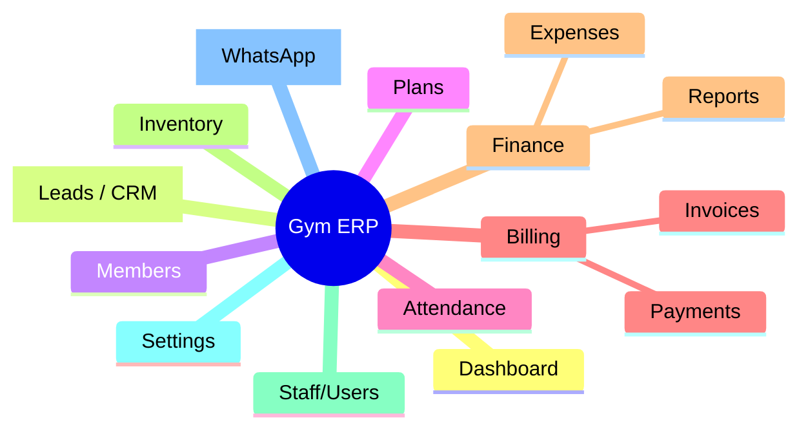

| Module | Present | Notes |
|---|:--:|---|
| Dashboard | ✅ | KPIs + charts + activity |
| CRM (Leads) | ✅ | pipeline, temperature, convert |
| Members | ✅ | full lifecycle, freeze, QR |
| Plans | ✅ | pricing/duration |
| Attendance | ✅ | manual kiosk + logs |
| Invoices | ✅ | auto-invoice, discounts, tax |
| Payments | ✅ | manual + partial ledger |
| Expenses | ✅ | categorised ledger |
| Inventory | ✅ | products + stock movements |
| Reports | ✅ | prediction, profit series, PDFs |
| Staff/Users | ✅ | invite, roles, status |
| Settings | ✅ | branding, reminders |
| Notifications | 🟡 | WhatsApp deep-links only |
| Classes/Sessions | 🟡 | tables exist, **no UI** |
| Subscriptions | ✅(data) | drives member expiry |
| Audit/Activity logs | 🟡 | `system_logs` + dashboard activity |
| Automation/Workflows/AI | ❌ | none |
| Compliance | ❌ | none |
| Support/Documents | ❌ | none |

---

## 7. Functional Documentation

Representative features (Inputs → Rules → Outputs). *(Full endpoint contracts in §11.)*

### 7.1 Register Member (`POST /members/register`)
- **Inputs:** memberCode?, fullName, phone?, email?, cnic?, emergencyContact*, dob?, medicalConditions?, planId, joinDate, createInvoice.
- **Rules:** name required; unique member_code per tenant; auto-generate code if blank 🔒; creates a `subscriptions` row (start=joinDate, end=join+plan.duration) and (optionally) an `invoices` row (subtotal=price+admission).
- **Outputs:** member id, code; invoice no (if created).
- **Failures:** duplicate code, missing plan, invalid tenant.
- **Note:** extra fields (cnic/medical/emergencyName) are **accepted by client but stripped by zod** unless in the server schema → 🟡 partial persistence.

### 7.2 Auto Invoice (`POST /billing/auto-invoice`)
- **Inputs:** memberId, planId, taxPercent (+ client sends discountType/value, method, status — **stripped by zod**).
- **Calc:** subtotal = plan.price + admission; tax = subtotal × tax%/100; total = subtotal + tax. **(Server ignores discount — see §9 gap.)**
- **Output:** invoiceNo, subtotal, tax, total.

### 7.3 Record Payment (`POST /payments/record`)
- **Inputs:** invoiceId, amount>0, method, reference?.
- **Rules/Ledger:** reject if invoice paid/void; `paidSoFar = Σ payments`; `balance = total − paidSoFar`; `applied = min(amount, balance)`; if `paidSoFar+applied ≥ total` → invoice `paid` (+ `payment_received` automation); else stays `unpaid` (partial). Prevents overpayment.
- **Output:** status, applied, paid, balance.

### 7.4 Mark Paid (`POST /invoices/mark-paid`)
- Inserts a full-total payment and sets invoice `paid` in a transaction; idempotent if already paid.

### 7.5 Check-in (`POST /attendance/checkin`)
- Resolve member by code/name/phone → insert `attendance_logs` (source manual) → return member + unpaid count (fees-pending guard).

### 7.6 Sell Product (`POST /products/sell`)
- Decrement stock via `stock_movements(out)`; guard against overselling 🔒.

*(Leads CRUD/convert, freeze/unfreeze, plan CRUD, expense CRUD, staff invite/roles, settings — all follow standard CRUD contracts in §11.)*

---

## 8. Business Workflows

### 8.1 Login
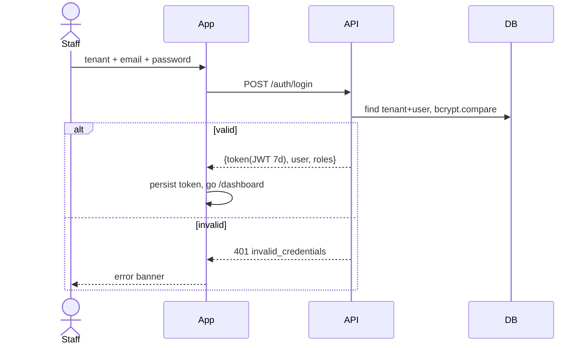

### 8.2 Member registration → first invoice
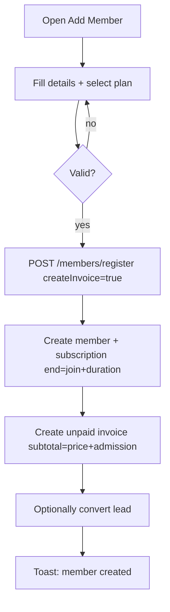

### 8.3 Billing & collection (partial payments)
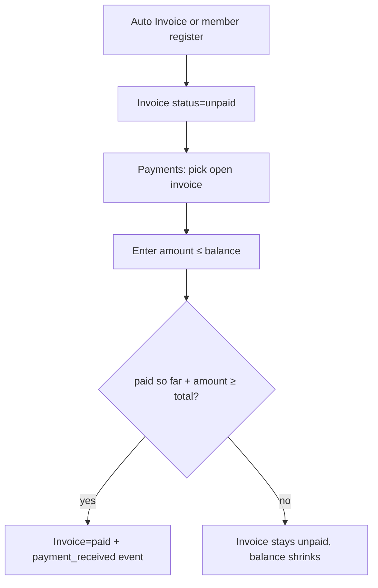

### 8.4 At-risk re-engagement
No check-in ≥ `at_risk_days` → surfaced on dashboard → staff taps WhatsApp CTA → `wa.me` deep link opens with templated message (`{name}{days}{gym}{code}`).

### 8.5 Forgot password
❌ **Not implemented.** Password reset must be done by an admin re-inviting / DB update. **Gap.**

### 8.6 Refund / Escalation / Subscription auto-renew
❌ No refund flow, no escalation, `auto_renew` flag exists but no scheduler acts on it. **Gaps.**

---

## 9. Finance Documentation

### 9.1 Concepts present
| Concept | Status | Detail |
|---|:--:|---|
| Pricing | ✅ | per-plan `price` + `admission_fee` |
| Invoices | ✅ | subtotal, discount, tax, total, status(draft/unpaid/paid/void) |
| Taxes | ✅ | `default_tax_percent` (settings) + per-invoice tax |
| Discounts | 🟡 | **UI computes %/fixed live**, but `auto-invoice` **server ignores discount** (only tax applied) — **integrity gap** |
| Payments | ✅ | methods cash/card/bank/online, `txn_ref` |
| Partial payments | ✅ | ledger via `/payments/record` |
| Refunds / credits / wallet / coupons | ❌ | none |
| Currency | ✅ | single, `PKR` default (no FX/multi-currency) |
| Profit / Loss | ✅ | `revenue − expenses` (reports) |
| Ledger | 🟡 | invoices+payments+expenses; no double-entry accounting |
| Settlement / payouts | ❌ | none (cash-basis, in-house) |

### 9.2 Key calculations
| Calculation | Formula | Where |
|---|---|---|
| Invoice subtotal | `plan.price + plan.admission_fee` | register / auto-invoice |
| Tax amount | `subtotal × taxPercent / 100` | auto-invoice |
| Invoice total | `subtotal − discount + tax` (UI) / `subtotal + tax` (server) | invoice modal / server |
| Discount (percent) | `subtotal × value/100`, clamped `[0, subtotal]` | UI |
| Discount (fixed) | `value`, clamped `[0, subtotal]` | UI |
| Balance due | `total − Σ payments` | payments/record |
| Applied payment | `min(amount, balance)` | payments/record |
| Profit | `Σ paid revenue − Σ expenses` | reports |
| Revenue prediction | trend over history (last months) | `/reports/revenue-prediction` |
| Membership expiry | `join_date + plan.duration_days` | subscription |

### 9.3 Financial permissions
Only `owner`/`admin` see revenue routes (invoices, payments, expenses, reports).

---

## 10. Data Model

### 10.1 Entities (from `schema.sql`)
Every business table carries `tenant_id` (+ generated `gym_id`) for multi-tenancy.

| Entity | Key fields | Status enum |
|---|---|---|
| **tenants** | slug, name | active/suspended |
| **users** | tenant_id, email, password_hash, full_name | active/disabled |
| **roles** | tenant_id, name | — |
| **user_roles** | user_id, role_id | — |
| **branches** | tenant_id, name, address | active/inactive |
| **members** | member_code, full_name, phone, email, gender, dob, join_date, notes, frozen_until/reason/at, branch_id | active/expired/inactive |
| **leads** | full_name, phone, source, interest, next_contact_date, notes | new/trial/converted/lost |
| **membership_plans** | name, duration_days, price, admission_fee | active/inactive |
| **subscriptions** | member_id, plan_id, start_date, end_date, auto_renew | active/expired/cancelled |
| **invoices** | member_id, subscription_id, invoice_no, subtotal, discount, tax, total, due_date | draft/unpaid/paid/void |
| **payments** | invoice_id, amount, method, txn_ref, paid_at | (method enum) |
| **attendance_logs** | member_id, branch_id, checked_in_at, checked_out_at, source | manual/qr/rfid |
| **classes / class_sessions** | name, capacity / class_id, trainer, times | active/inactive (no UI) |
| **expenses** | category, amount, expense_date, notes, branch_id | — |
| **products** | name, sku, price | active/inactive |
| **stock_movements** | product_id, qty, movement_type, reason | in/out |
| **gym_settings** | currency, default_tax_percent, enable_sounds/animations, at_risk_days, at_risk_whatsapp_template | — |
| **gym_profile** | name/address/socials 🔒 | — |
| **system_logs** | tenant, event 🔒 | — |

### 10.2 ERD
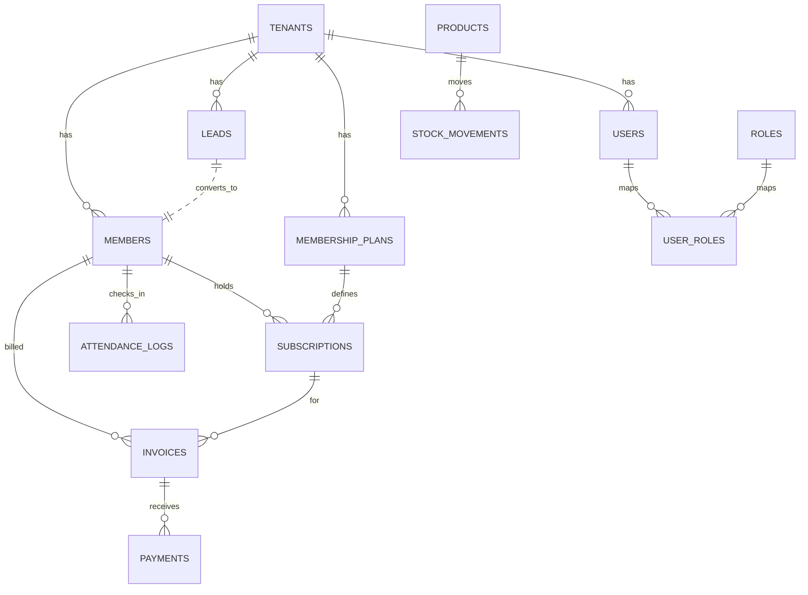

### 10.3 Lifecycle notes
- **Member:** active → expired (end_date passed) / inactive (archived) / frozen (frozen_until set).
- **Invoice:** unpaid → paid (fully) / void; partial stays unpaid with reduced balance.
- **Lead:** new → trial → converted (spawns member) / lost.
- **Subscription:** active → expired/cancelled; renewal creates a new period.

---

## 11. API Documentation

**Base:** `http://<host>:8081` · **Auth:** `Authorization: Bearer <JWT>` (except public) · **Content-Type:** `application/json` · **Custom header:** `ngrok-skip-browser-warning: true`.

### 11.1 Endpoint index (complete)

| Method | Endpoint | Auth | Roles | Purpose |
|---|---|:--:|---|---|
| GET | `/` `/health` `/__version` | ➖ | — | Liveness/version |
| POST | `/dev/seed` | ➖* | — | Bootstrap tenant+admin (blocked in prod) |
| POST | `/dev/seed-mock` | ➖* | — | Seed demo data |
| POST | `/auth/login` | ➖ | — | Issue JWT |
| GET | `/auth/me` | ✅ | any | Current user + roles |
| GET/PUT | `/settings` | ✅ | owner/admin | Gym settings |
| GET | `/dashboard/summary` `/dashboard/activity` | ✅ | any | KPIs / feed |
| GET | `/search` | ✅ | any | Global search |
| GET/POST | `/leads` · PATCH/DELETE `/leads/:id` · POST `/leads/:id/convert` | ✅ | any/owner-admin | CRM |
| GET | `/members` `/members/:id` `/members/:id/detail` `/members/expiring` | ✅ | any | Member reads |
| POST | `/members/register` `/members` | ✅ | owner/admin | Create member |
| PATCH/DELETE | `/members/:id` · POST change/remove-membership, freeze/unfreeze | ✅ | owner/admin | Lifecycle |
| GET/POST | `/plans` · PATCH/DELETE `/plans/:id` · DELETE `/plans/:id/hard` | ✅ | any/owner-admin | Plans |
| POST | `/attendance/checkin` · GET `/attendance` `/attendance/today` | ✅ | any | Attendance |
| GET | `/invoices` `/invoices/:id` `/invoices/:id/pdf` | ✅ | owner/admin | Invoices |
| PATCH/POST | `/invoices/:id`, `/invoices`, `/billing/auto-invoice`, `/invoices/mark-paid` | ✅ | owner/admin | Billing |
| GET/POST | `/payments` `/payments/summary` `/payments/record` · PATCH/DELETE `/payments/:id` | ✅ | owner/admin | Collections |
| GET/POST | `/expenses` `/expenses/summary` · PATCH/DELETE `/expenses/:id` | ✅ | owner/admin | Expenses |
| GET/POST | `/products` · PATCH/DELETE `/products/:id` · POST `/products/sell` | ✅ | non-recept | Inventory |
| POST/GET | `/stock/move` `/stock/movements` | ✅ | non-recept | Stock |
| GET/POST | `/staff` · PUT `/staff/:id/roles` · PATCH `/staff/:id/status` | ✅ | owner/admin | Users |
| GET | `/reports/profit-series` `/reports/revenue-prediction` | ✅ | owner/admin | Analytics |
| GET | `/reports/*.pdf`, `/pdf/*.pdf`, `/invoices/:id/pdf` | ✅ | owner/admin | PDF exports |
| GET | `/sentinel/validate` | ✅ | any 🔒 | integrity check |

\* `/dev/*` gated by `ALLOW_DEV_SEED` and disabled when `NODE_ENV=production`.

### 11.2 Representative contracts

**POST `/auth/login`**
```jsonc
// req
{ "tenantSlug": "demo", "email": "admin@demo.com", "password": "admin123" }
// 200
{ "token": "<jwt>", "user": { "id", "email", "fullName", "tenantSlug", "roles": ["owner"] } }
// 401 { "error": "invalid_credentials" }
```

**POST `/payments/record`**
```jsonc
// req
{ "invoiceId": 12, "amount": 25000, "method": "cash", "reference": "TX-1" }
// 200
{ "ok": true, "status": "paid", "applied": 25000, "paid": 25000, "balance": 0 }
// 400 invoice_already_paid | invoice_voided | invalid_request
```

**Common status codes:** 200 ok · 201 created · 400 invalid_request/business error · 401 unauthorized · 403 forbidden (role) · 404 not_found · 500 server error.
**Not present:** rate-limits, response caching, retry/idempotency keys (except mark-paid's alreadyPaid short-circuit). 🔒

---

## 12. Component Library

Shared widgets (mostly in `lib/src/core/`):

| Component | Purpose | Variants / props |
|---|---|---|
| `FormRow` | Responsive 2-/3-col form grid | breakpoint, gap |
| `FormSectionLabel` | Section header + hint + icon | — |
| `FormSegmented<T>` | Pill segmented control | per-segment colour/icon |
| `FormMultiChips` | Multi-select filter chips | accent, hint |
| `showAppFormDialog` / `AppFormDialog` | Standard modal frame | maxWidth, actions |
| `showAppConfirmDialog` | Confirm dialog | danger |
| `AppHScroll` | Swipe-scroll filter strip (hidden bar) | spacing, padding |
| `AppFilterPill` / `_FilterPill` | Filter tag | selected, accentOverride |
| `AppTableActionButton` | Row action (eye/edit/delete) | danger, tooltip |
| `AppDashedPanel` | Dashed drop-zone / empty | radius, colours |
| `appDenseInputDecoration` | Compact filter input | — |
| `_MetricCard` / metric cards | KPI tiles | width, accent, onTap |
| `_DonutPiePainter` / `_RevenueChartPainter` | Custom charts | ring width, colours |
| `PoweredByDeverosity` | Branding link | underline |
| `_QuickActionsButton` | Global "+" popover | onQuickAction |
| `InAppPdfPreviewer` | PDF viewport (printing) | bytes, title |

**Cross-cutting:** all inherit the global `InputDecorationTheme` (radius 8), `CardTheme`/`DialogTheme` (radius 14), and `AppRadius` tokens (6/8/14/pill).

---

## 13. UX Documentation

- **Information architecture:** grouped sidebar — Overview, CRM, Members, Billing, Finance, Operations, Admin.
- **Navigation:** persistent sidebar (desktop) / drawer (mobile) + top bar + global "+" quick actions + deep-link quick actions (navigate → auto-open create modal).
- **Personas:** Owner (finance+strategy), Admin (operations), Staff (members/inventory), Receptionist (check-in/leads).
- **Primary journeys:** onboard member → bill → collect; capture lead → nurture → convert; daily check-ins; monthly reporting.
- **Feedback:** SnackBar toasts, inline validation, loading spinners, empty states, confirm dialogs.
- **Heuristics/accessibility:** ✅ visual hierarchy, consistency, error prevention (validators, overpay guard); 🟡 keyboard (Ctrl/Cmd-K search) but limited; ❌ no screen-reader audit, no formal WCAG contrast pass.
- **Microinteractions:** hover scale, animated segmented/donut, tween-sized grids.

---

## 14. UI / Design System

- **Theme:** "Obsidian × Gold × Emerald" dark-first, plus light mode. Dynamic **brand accent** (any colour, persisted via SharedPreferences) drives `ColorScheme.primary`.
- **Typography:** dual-font — **Bebas Neue** (display/KPIs/section headers, tracked) + **Inter** (body/data). Helper `AppTypography`.
- **Tokens (`AppTheme`/`AppRadius`):** obsidian `#0B0B0C`, charcoal `#16161A`, gold `#D4AF37`, emerald `#10B981`, crimson `#DC2626`, borders `borderSubtle/borderHover`; radii small 6 / medium 8 / large 14 / pill 999.
- **Charts:** custom painters (donut, revenue line) + fl_chart (reports).
- **Dark/Light:** both fully themed; theme toggle in top bar & login.
- **Responsive:** desktop DataTables → mobile stacked cards; headers wrap; single-column grids on phones; login scrollable; charts fluid.

---

## 15. Security

| Control | Status | Detail |
|---|:--:|---|
| Authentication | ✅ | JWT HS256, 7-day expiry, `Bearer` header |
| Password storage | ✅ | bcryptjs (cost 10) |
| Authorization | ✅ | `requireRole` per endpoint; tenant scoping on every query |
| Input validation | ✅ | zod (strips unknown keys → mass-assignment safe) |
| SQL injection | ✅ | parameterised named placeholders (mysql2) |
| Multi-tenant isolation | ✅ | `tenant_id` on all queries |
| Secrets | ✅ | `.env` (gitignored), `JWT_SECRET` |
| Transport | 🟡 | HTTPS via tunnel/cloud; cleartext allowed for LAN |
| CORS | 🟡 | `origin:true` (reflect any) — tighten for prod |
| CSRF | N/A | token-based API, no cookies |
| XSS | N/A | Flutter (no HTML injection surface) |
| Rate limiting / brute-force | ❌ | none on `/auth/login` |
| Audit logs | 🟡 | `system_logs`, not comprehensive |
| Dev endpoints | ✅ | `/dev/*` disabled in production |
| MFA / SSO / OAuth | ❌ | none |

---

## 16. Notification System

| Channel | Status | Detail |
|---|:--:|---|
| WhatsApp | 🟡 | `wa.me` deep links (dues, expiry, at-risk) with templated body |
| In-app | 🟡 | dashboard "Recent Activity", expiry bell, at-risk panel |
| Email / SMS / Push | ❌ | none |
| Real-time | ❌ | client polling/invalidation, no websockets |
| Templates | ✅ | at-risk WhatsApp template in settings (`{name}{days}{gym}{code}`) |
| Scheduling / retries | ❌ | manual, user-triggered |

---

## 17. Reporting System

- **Dashboards:** operational KPIs, 7-day revenue, active/expired donut, insights.
- **Reports module:** Revenue Prediction (next month), Expense vs Revenue (profit margin), profit series.
- **Exports:** server-generated **PDF** for dashboard, leads, members, plans, attendance, inventory, invoices, invoice/:id, payments, reports, expenses, staff, settings, monthly-revenue, expired-members, daily-attendance. CSV export for members/products (client-side).
- **Filters:** date/month pickers, type/status filters.
- **Permissions:** revenue reports → owner/admin.
- **Scheduling:** ❌ (on-demand only).

---

## 18. Settings

| Setting | Field | Persistence |
|---|---|---|
| Currency | `currency` (PKR default) | `gym_settings` |
| Default tax % | `default_tax_percent` (5) | `gym_settings` |
| At-risk days | `at_risk_days` (3) | `gym_settings` |
| WhatsApp template | `at_risk_whatsapp_template` | `gym_settings` |
| Sounds / Animations | `enable_sounds/animations` | `gym_settings` |
| Gym profile | name/address/socials 🔒 | `gym_profile` |
| Theme mode | dark/light | SharedPreferences (device) |
| Brand accent colour | custom hex | SharedPreferences (device) |
| Server URL | override | SharedPreferences (device) |
| **Missing** | API keys, billing, integrations, audit, developer, org/branches UI | ❌ |

---

## 19. Integrations

| Integration | Status |
|---|:--:|
| WhatsApp (deep-link) | 🟡 |
| url_launcher (external URLs) | ✅ |
| ngrok / Railway (deploy) | ✅ (ops) |
| Payment gateway (JazzCash/EasyPaisa/Stripe) | ❌ (method label only) |
| Email/SMS provider | ❌ |
| Maps / Cloud storage / AI / external analytics / CRM/ERP / webhooks / OAuth | ❌ |

---

## 20. State Management

- **Global:** Riverpod providers — `authControllerProvider`, `apiClientProvider`, `serverUrlProvider`, `themeModeProvider`, `accentProvider`/`accentColorProvider`, feature controllers (`membersControllerProvider`, `invoicesControllerProvider`, `paymentsController`, `leadsController`, etc.), `pendingQuickActionProvider`.
- **Local:** `StatefulBuilder`/`setState` inside modals; `TextEditingController`s.
- **Persistence:** SharedPreferences (token, theme, accent, server URL) via `TokenStore`.
- **Caching:** `FutureProvider.autoDispose` for reads; manual `ref.invalidate` refresh.
- **Offline/sync:** ❌ no offline queue; server-dependent.

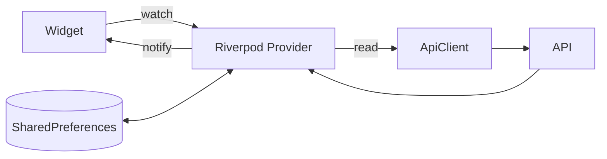

---

## 21. Complete Business Logic (rules · calcs · triggers)

- **Calculations:** see §9.2 (invoice/tax/discount/balance/profit/expiry).
- **Validations:** name ≥2, email `@`, amount numeric >0 and ≤ invoice total, plan required, code length, payment ≤ balance.
- **Triggers/automation (in-app, synchronous):** `payment_received` automation on full payment; member auto-expiry via `end_date`; lead→member on convert; freeze sets status/frozen_until.
- **Scheduled tasks:** ❌ none (no cron). Expiry is computed on read, not pushed.
- **Approval flows:** ❌ none.
- **Dependencies:** invoice ⇒ member+plan; payment ⇒ open invoice; attendance ⇒ member; subscription ⇒ member+plan.
- **Migrations on boot:** idempotent `CREATE TABLE IF NOT EXISTS` (attendance_events, gym_settings/profile, leads, system_logs, membership_plans) + `ALTER` (indexes, `payments.reference`).

---

## 22. QA Documentation

### 22.1 Acceptance criteria (samples)
- Login with valid creds → dashboard; invalid → error, no token stored.
- Register member with plan → member + subscription + unpaid invoice created; expiry = join + duration.
- Record partial payment → invoice stays unpaid, balance reduces; final payment → paid.
- Overpayment attempt → capped at balance / rejected.
- Role `receptionist` → cannot open `/invoices` (redirect).

### 22.2 Edge / negative cases
| Case | Expected |
|---|---|
| Payment > balance | applied capped; no overpay |
| Pay a paid/void invoice | 400 error |
| Duplicate member_code | rejected (unique) |
| Invoice filter `status=unpaid,partial` | returns open invoices (IN clause) |
| Offline / server down | "Cannot connect" + Server settings hint |
| Empty lists | empty-state widgets |
| Very small screen (<300px) | cards/labels ellipsize, no overflow |
| Missing phone for WhatsApp | "Phone missing" toast |

### 22.3 Non-functional
- **Performance:** single node, pool 10; no pagination on some lists 🟡.
- **Security:** see §15 (add rate-limit, tighten CORS).
- **Accessibility:** contrast + screen-reader audit pending.
- **Regression:** `flutter analyze` clean; no automated test suite (❌ **gap**).

---

## 23. Future Scalability

| Area | Opportunity |
|---|---|
| **Tech debt** | No automated tests; discount ignored in server auto-invoice; classes/sessions & branches have tables but no UI; receipt upload is a placeholder |
| **Performance** | Add pagination everywhere, indexes review, response caching (Redis) |
| **Architecture** | Extract PDF/report workers, add job queue for reminders, websockets for live activity |
| **Business** | SaaS billing/metering, self-service signup, multi-branch, classes/booking, trainer scheduling |
| **Payments** | Real gateway (JazzCash/EasyPaisa/Stripe), online receipts, refunds |
| **Notifications** | WhatsApp Business API, email/SMS, scheduled reminders, push |
| **i18n/l10n** | English-only strings; add Urdu + multi-currency/FX |
| **White-label** | Per-tenant branding is 80% there (accent/profile) — extend to logo/domain |
| **Enterprise** | SSO/MFA, audit trail, RBAC granularity, compliance (data export/delete) |
| **Reliability** | Health checks, monitoring, backups, CI/CD |

---

## 24. Project Knowledge Base & Diagrams

### 24.1 Folder structure
```
gym_management_system/
├── lib/src/
│   ├── core/         # theme, providers, api_client, token_store, ui_kit, form_dialog,
│   │                 # branding, in_app_pdf, whatsapp, app_theme
│   ├── features/     # dashboard, leads, members, plans, attendance, billing(invoices),
│   │                 # payments, expenses, inventory, reports, staff, settings, auth, shell
│   └── models/       # models.dart (Member, Lead, Invoice, Payment, Plan, ...)
├── server/
│   ├── src/server.js # Express API + routes + PDFKit
│   ├── src/db.js     # mysql2 pool (env-driven, optional SSL)
│   └── schema.sql    # full DB schema
├── android/          # manifest (INTERNET + cleartext)
├── docs/PRODUCT_OVERVIEW.md
├── DEPLOY.md · start-server.bat · README.md
```

### 24.2 Routing / Navigation map
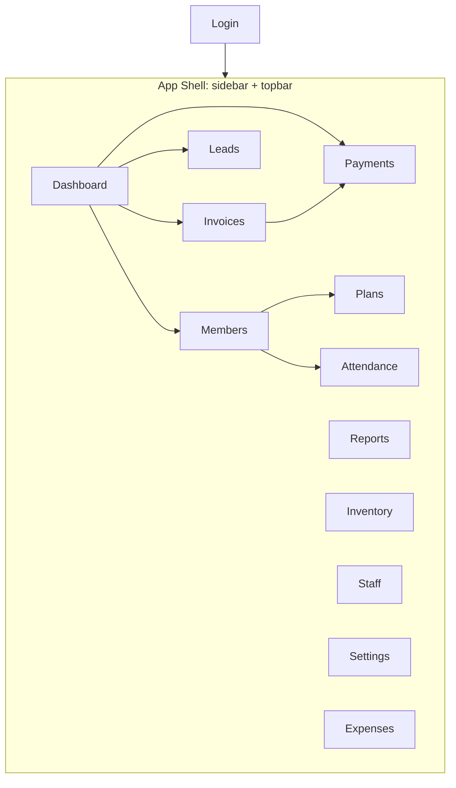

### 24.3 Permission matrix
See **§5.1**.

### 24.4 Data-flow diagram
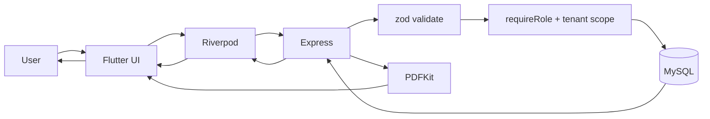

### 24.5 Financial flow
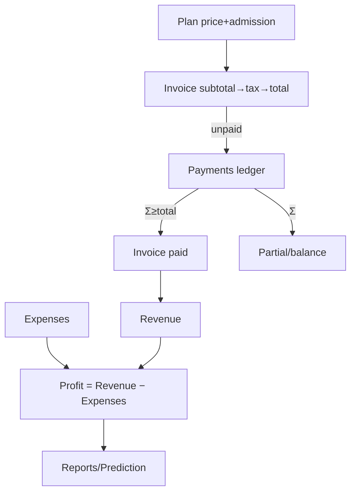

### 24.6 System flow (deployment)
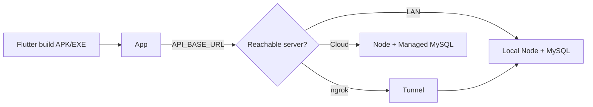

### 24.7 Notification flow
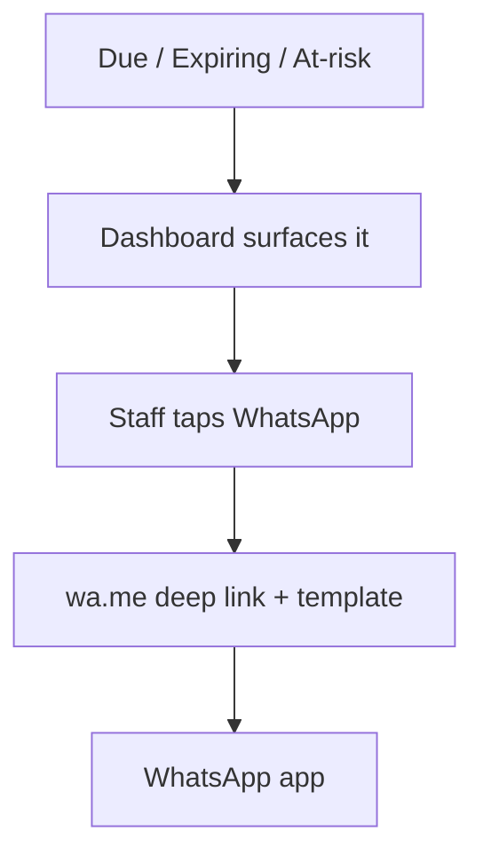

---

### Appendix A — Known gaps summary (for redesign backlog)
1. Server `auto-invoice` ignores discount (finance integrity). 
2. No password reset / self-service signup. 
3. Classes/sessions, branches: schema without UI. 
4. Receipt upload is a placeholder (no file storage). 
5. No automated tests, cron, queues, websockets, caching. 
6. Notifications limited to WhatsApp deep-links. 
7. No real payment gateway; no refunds/wallet/coupons. 
8. CORS `origin:true`; no login rate-limit. 
9. English-only; single currency. 
10. SaaS-level billing/metering absent.

---

> **Powered by Deverosity** · This document reflects the codebase state at time of reverse-engineering and should be version-controlled alongside the source.
